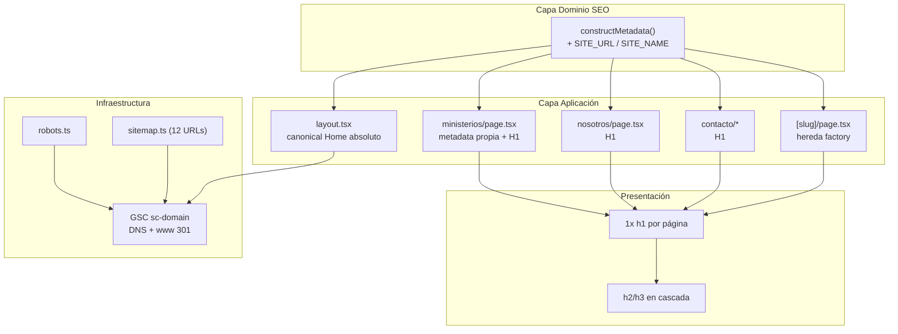

# Correcciones SEO — new-church-template (Bioiglesia)

**Fecha:** 2026-09-16
**Base:** `docs/arquitectura/auditoria-seo-new-church-template.md` (67/100)
**Alcance:** Solo desbloqueo de indexación (H1 + metadata + canonical). No se tocó LCP, schema completo, ni `www` redirect.
**Estado verificación:** `npx tsc --noEmit` ✅ limpio · `npm run lint` ⚠️ 2 errores preexistentes en `src/components/ui/color-mode.tsx` (no bloquean `dev`, archivos SEO limpios)
**GSC:** sitemap verde 12 descubiertas · 1 no indexada `www` (correcto) · 3 a reindexar tras deploy (`/nosotros`, `/contacto`, `/ministerios`)

---

## 1. Estructura de carpetas y módulos afectados

```
src/
├── lib/
│   └── metadata.ts                  # Factory único de metadata (fuente de verdad SEO)
├── app/
│   ├── layout.tsx                   # metadataBase + canonical Home absoluto
│   ├── sitemap.ts                   # (sin cambios) 4 estáticas + 8 slugs = 12
│   ├── robots.ts                    # (sin cambios) Allow / + sitemap absoluto
│   ├── page.tsx                     # (sin cambios) Home con H1 + schema Church
│   ├── (pages)/
│   │   ├── nosotros/page.tsx        # + H1 hero (FIX)
│   │   ├── contacto/
│   │   │   ├── page.tsx             # (sin cambios) ya usaba constructMetadata
│   │   │   └── ContactClient.tsx    # + H1 hero (FIX)
│   │   └── ministerios/
│   │       ├── page.tsx             # + metadata propia + H1 (FIX CRÍTICO)
│   │       └── [slug]/page.tsx      # (sin cambios) hereda fix vía factory
└── components/
    └── ui/color-mode.tsx            # (no tocado) 2 errores lint preexistentes
```

Propuesta a futuro (no implementada): `src/seo/` con `constants.ts` (SITE_URL), `titles.ts` (reglas 50-60), `descriptions.ts` (150-160) si el factory crece.

---

## 2. Responsabilidades por capa

| Capa | Archivos | Responsabilidad | Lo que NO debe hacer |
| ---- | -------- | --------------- | -------------------- |
| **Dominio SEO** | `src/lib/metadata.ts` (`SITE_NAME`, `SITE_URL`, `CustomMetadata`, `constructMetadata`) | Única fuente de verdad: sufijo de marca, canonical absoluto, `noIndex`. Decide el contrato, no el render. | No conocer Chakra, ni JSX, ni rutas concretas más allá del contrato. |
| **Aplicación (App Router)** | `layout.tsx`, `(pages)/*/page.tsx`, `[slug]/page.tsx` | Declarar por página: título, descripción, canonical autocontenido, un H1. Orquesta, no calcula. | No concatenar strings de dominio ni duplicar sufijos (delegan al factory). |
| **Presentación** | `Hero`, `ContactClient`, tarjetas, `Heading` Chakra | Renderizar UN `h1` semántico por página + `h2/h3` en cascada, sin cambiar diseño visual. | No usar `div` como encabezado ni dos H1. |
| **Infraestructura** | `robots.ts`, `sitemap.ts`, GSC (dominio `sc-domain`, DNS) | Descubrimiento (`Allow /` + sitemap absoluto con 12 URLs) y verificación (DNS, sin token HTML). | No usar `robots.txt` para desindexar (eso es `noindex`), no listar `www` ni `/links` en sitemap. |

Principios: DRY (dominio una vez), KISS (un H1, un canonical), SRP (cada capa una razón de cambio), DIP (las páginas dependen del contrato `CustomMetadata`, no del string del dominio).

---

## 3. Diagrama Mermaid



---

## 4. Correcciones aplicadas (archivo:línea)

| # | Archivo:línea | Antes → Después | Efecto SEO |
| - | ------------- | --------------- | ---------- |
| 1 | `src/lib/metadata.ts` (constantes + sufijo + `title.absolute` + `new URL`) | Título plano sin marca y canonical relativo → sufijo condicional `\| Bioiglesia` + `title.absolute` anti-duplicación + canonical absoluto | `Nosotros` → `Nosotros \| Bioiglesia`; `/nosotros` → `https://bioiglesia.com/nosotros`. Cierra duplicación con `template` del layout. |
| 2 | `src/app/(pages)/ministerios/page.tsx` (metadata + H1) | Sin `metadata`, heredaba `canonical: '/'` + hero `h2` → metadata propia (título 57 chars, desc 157 chars, canonical absoluto) + `as="h1"` | Elimina señal "no me indexes"; página elegible para indexación. |
| 3 | `src/app/(pages)/nosotros/page.tsx` (H1) | Hero `h2` (0 H1) → `as="h1"` único; 4 restantes quedan `h2` | Recupera señal principal del tema. |
| 4 | `src/app/(pages)/contacto/ContactClient.tsx` (H1) | Hero `h2` (0 H1) → `as="h1"` único; 5 restantes `h2` | Idem. Formulario y mapa intactos. |
| 5 | `src/app/layout.tsx` (canonical + `SITE_URL`) | `canonical: '/'` relativo → `` `https://bioiglesia.com/` `` vía `SITE_URL` compartido | Canonical inequívoco `www` vs apex; cambio de dominio futuro en un lugar. |

Efecto colateral positivo (sin tocar `[slug]/page.tsx`): slugs `MAAOC` → `MAAOC | Bioiglesia` y sus canonicals relativos se absolutizan solos.

No tocado a propósito: `robots.ts`, `sitemap.ts` (verde 12/12), redirect `www` → apex 301 (correcto), token `verification.google` (innecesario con DNS), `Avatar alt`, LCP 878KB, schema completo.

---

## 5. Justificación de decisiones y trade-offs

**D1. Factory central vs metadata inline.** Problema: 5 páginas resolvían marca/canonical cada una a su manera (o no lo resolvían). Alternativa descartada: pegar strings en cada `page.tsx` — rápido hoy, divergencia mañana. Trade-off: una indirección más a cambio de consistencia total. Ganas DRY, sacrificas lectura literal inmediata.

**D2. `title.absolute` vs string plano.** Problema: `template: '%s | Bioiglesia'` del layout duplicaría el sufijo. Alternativa descartada: quitar el `template` del layout — rompería páginas que no pasan por el factory. Trade-off: acoplas el factory al comportamiento App Router a cambio de una sola aplicación del sufijo. Fuente: Next.js Metadata + Google SEO Starter Guide (50-60 chars).

**D3. `new URL(canonical, SITE_URL)` vs concatenar.** Problema: canonical relativo ambiguo entre `www`/apex. Alternativa descartada: `SITE_URL + canonical` — falla con trailing slash o canonical ya absoluto. Trade-off: dependencia del parser nativo a cambio de idempotencia. Fuente: Google Canonicalización (URL absoluta).

**D4. H1 semántico sin cambio visual.** Problema: 0 H1 en 3 páginas. Alternativa descartada: `div` grande con estilos — idéntico visual, cero semántico. Trade-off: ninguno visual; ganas landmark + señal de tema. Fuente: MDN Heading Elements. Error que evita: creer que Chakra `Heading` ya es H1 (su default es `h2`).

**D5. No tocar `www` ni agregar token.** Problema: tentar "arreglar" lo verde. Alternativa descartada: listar `www` en sitemap o agregar verificación HTML redundante. Trade-off: dejas un "pendiente aparente" a cambio de no crear duplicado. Fuente: Google Códigos HTTP + Verificación site (DNS válido).

Deuda asumida: títulos `Nosotros | Bioiglesia` (21 chars) y desc default (171 chars) siguen fuera del rango ideal 50-60 / 150-160; slugs cortos; LCP y schema parcial pendientes (optimización, no desbloqueo).

---

## 6. Contratos (sin implementación)

```typescript
interface CustomMetadata {
  title?: string;       // sin marca; el factory agrega " | Bioiglesia" si falta
  description?: string; // objetivo 150-160 chars, corte por palabra
  image?: string;       // path relativo; se absolutiza vía metadataBase
  noIndex?: boolean;    // true solo para utilitarias/404 (ej. /links)
  canonical?: string;   // relativo ("/nosotros") o absoluto; sale absoluto
}

function constructMetadata(input?: CustomMetadata): Metadata;
// post: title incluye marca una sola vez; alternates.canonical absoluto si input.canonical existe
```

```typescript
// Contrato por página indexable
interface IndexablePage {
  metadata: Metadata; // título 50-60, desc 150-160, canonical absoluto autocontenido
  h1Count: 1;         // exactamente un h1 (hero); resto h2/h3
}
```

---

## 7. Errores comunes a evitar con este patrón

1. Heredar `canonical: '/'` por no exportar `metadata` — convierte la página en alias del Home.
2. Duplicar sufijo (`X | Bioiglesia | Bioiglesia`) por combinar `template` + string plano sin `absolute`.
3. Agregar `www` al sitemap o canibalizar con canonical cruzado apex↔www.
4. Pedir indexación antes del deploy (GSC inspecciona lo vivo, no tu rama).
5. Usar `robots.txt` para ocultar (`disallow`) en vez de `noindex`, o `loading="lazy"` en el hero.

---

## 8. Validación y siguiente paso (deploy del usuario)

- [x] `npx tsc --noEmit` limpio
- [x] `npm run lint` limpio en los 5 archivos (2 errores ajenos en `color-mode.tsx`)
- [ ] `npm run dev` — revisión visual del usuario (sin cambios esperados) + Ver fuente: 1× `<h1`, `<link rel="canonical" href="https://bioiglesia.com/...">`
- [ ] Deploy → GSC Inspección de URLs → Solicitar indexación: `/ministerios`, `/nosotros`, `/contacto` (límite diario sobrado para 3)
- [ ] 3-7 días: Páginas → verificar paso a Indexada; luego atacar LCP + schema + títulos 50-60 completos

---

## 9. Para reflexionar

1. Si `new URL()` ya absolutiza, ¿por qué declarar el canonical absoluto en cada página en vez de confiar solo en `metadataBase`?
2. Con un H1 recuperado pero un título de 21 chars, ¿qué pesa más en el CTR: el H1 o el `<title>`, y por qué?
3. ¿Cómo distinguirías en GSC "Descubierta sin indexar" (cola) de "Rastreada sin indexar" (calidad) para decidir si crear contenido o esperar?

---

## Firma

**Ejecutor:** `@coder-tutor` · **Revisor:** rol tutor-arquitecto · **Fecha:** 2026-09-16 · **Versión:** v1.0
**Fuentes:** Google Search Central (Starter Guide, Canonical, Sitemaps, Verificación), Next.js Metadata/ESLint/Type Checking, MDN Heading Elements, TypeScript tsc CLI
